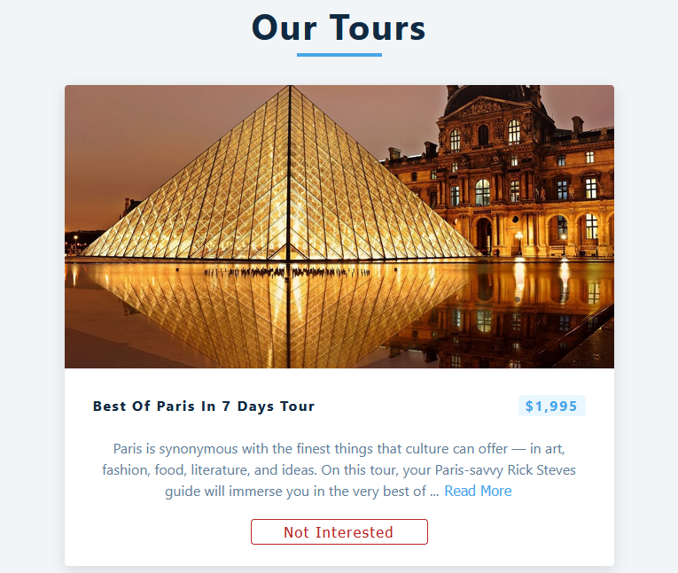

# Tours

This simple React app has been made while following a [YouTube tutorial](https://www.youtube.com/watch?v=a_7Z7C_JCyo).


uidesigndaily

## What I've learned

* [React useEffect](https://reactjs.org/docs/hooks-effect.html)
* Loading State
* [JS Substring](https://developer.mozilla.org/en-US/docs/Web/JavaScript/Reference/Global_Objects/String/substring)

### useEffect()

```javascript
  useEffect(() => {
    fetchTours();
  }, [])
```

### Loading State

```javascript
  const [loading, setLoading] = useState(true);
  const fetchTours = async () => {
    setLoading(true);
    try {
      ...
      setLoading(false);
    } catch (error) {
      setLoading(false);
      ...
    }
  }
```

### JS Substring

```javascript
  `${info.substring(0, 200)}...`
```